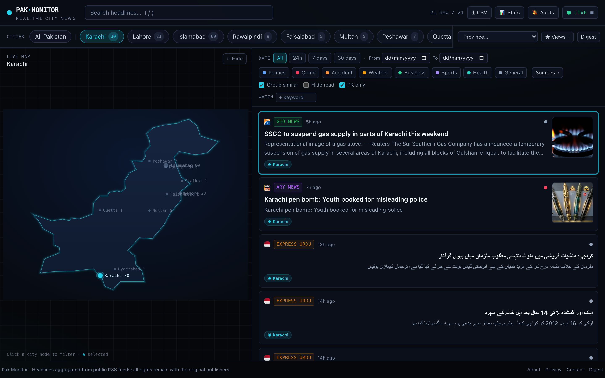
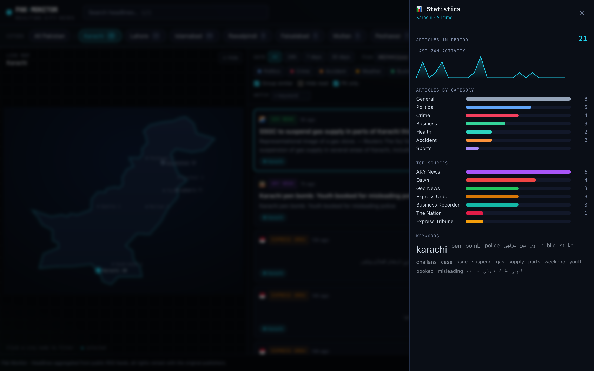
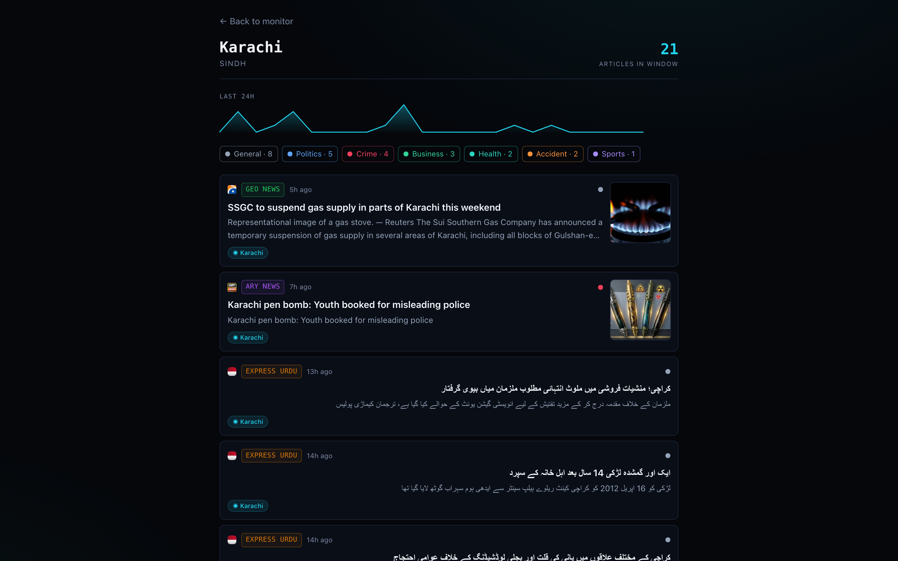
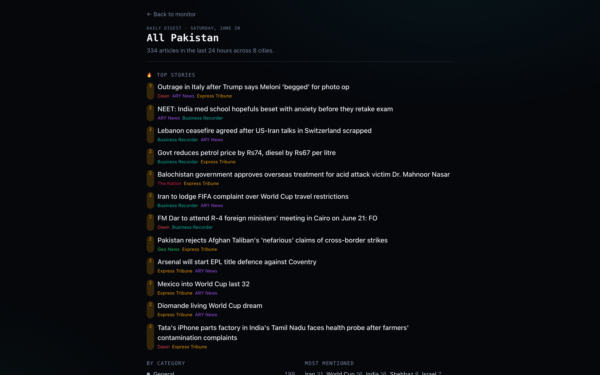

<div align="center">

# 🛰️ Pak Monitor

### Realtime news monitor for Pakistan — a glowing map + live feed of everything happening across the country's cities.

[](https://pak-monitor.pages.dev)
&nbsp;
[](https://github.com/murtazabali/pak-monitor/actions/workflows/ci.yml)
&nbsp;
[](LICENSE)

<br/>

<a href="https://pak-monitor.pages.dev">
  
</a>

</div>

---

Pick one or more cities and watch everything happening there stream in — on a live map of Pakistan and a realtime feed, grouped by story and tagged by topic. **Aggregated from ~25 Pakistani outlets, no API keys, no account.** Default city is **Karachi**.

<table>
  <tr>
    <td width="33%"><a href="https://pak-monitor.pages.dev"></a></td>
    <td width="33%"><a href="https://pak-monitor.pages.dev/city/karachi"></a></td>
    <td width="33%"><a href="https://pak-monitor.pages.dev/digest"></a></td>
  </tr>
  <tr align="center">
    <td>📊 Scoped statistics drawer</td>
    <td>🏙️ Per-city pages</td>
    <td>📰 24-hour digest</td>
  </tr>
</table>

## ✨ Features

- **🗺️ Live map of Pakistan** — every monitored city is a node that **pulses when fresh news lands**. Click a node to filter.
- **📡 Auto-refreshing feed** — new stories appear as the data refreshes; pause / resume any time.
- **🔗 Story clustering** — the same event across outlets is grouped into one card with a **"N outlets reporting"** badge, plus a **🔥 Trending** strip of the most-reported stories.
- **🏙️ City & province filtering** — multi-select chips (Karachi by default). Articles match by city name + known neighborhoods/landmarks (Karachi ⇒ Clifton, Saddar, Korangi…), in English **and Urdu**.
- **🎛️ Rich filters** — category tags (politics/crime/weather/accident/business/sports/health), source filter, date range (rolling 24h/7d/30d or custom), and instant search.
- **⭐ Watchlist + alerts** — track keywords (highlighted in the feed) and opt into browser notifications + a sound ping for breaking news.
- **📊 Stats drawer** — per-hour sparkline, top cities/categories/sources, a keyword cloud and "most mentioned" entities — all **scoped to your current selection**.
- **🧾 Outputs** — a 24-hour **[digest](https://pak-monitor.pages.dev/digest)**, per-city pages (`/city/karachi`), **CSV export**, **saved views**, and **shareable URLs** (every filter lives in the query string).
- **🔬 Signal extras** — activity-spike alerts, sentiment tone, entity extraction, and a PK-only relevance filter to cut foreign noise.
- **⌨️ Keyboard nav** (`j`/`k`/`o`/`/`) · **📱 installable PWA** · **🌑 dark "intel command-center" aesthetic.**

## 🏗️ How it works — a static site with **zero backend**

A browser can't fetch news RSS directly (CORS), so the feeds are pulled **off-browser by a free GitHub Action**, baked into a JSON snapshot, and served from GitHub's CDN. The deployed site is **100% static — no servers, no functions, no database.**

```
   ┌─ GitHub Actions · every ~5 min · free ───────────────────────────┐
   │   fetch ~25 RSS feeds (server-side, browser UA, fault-isolated)   │
   │   normalize · tag cities · classify topics · cluster stories      │
   │   write snapshot.json  ──▶  force-push to the orphan `data` branch │
   └──────────────────────────────────────────────┬───────────────────┘
                                                   │ (single commit, no history growth)
                                                   ▼
        raw.githubusercontent.com/…/data/snapshot.json   ← GitHub CDN, CORS-enabled
                                                   │
                                                   ▼
        Static site on Cloudflare Pages  ──reads──▶  snapshot.json
        dashboard · city pages · digest  (all rendered in the browser)
```

Because data refreshes live on a separate `data` branch (force-pushed as one commit), **the host only ever rebuilds when the code changes** — data updates cost nothing and never bloat git history.

## 🧱 Tech stack

| Concern | Choice |
|---|---|
| Framework | Next.js 15 (App Router, **static export**) + React 19 + TypeScript |
| Styling | Tailwind CSS |
| Data | Prebuilt JSON snapshot, refreshed by **GitHub Actions**, served from GitHub's CDN |
| Ingestion | `rss-parser` (runs in CI, never at request time) |
| Map | `d3-geo` + a bundled Pakistan GeoJSON (renders fully offline) |
| Hosting | Cloudflare Pages — static, **zero serverless functions** |
| Tests | Vitest (unit) + Playwright (E2E) |

## 🚀 Run it locally

No API keys. No accounts. No database. The repo ships with a seed snapshot, so it works the moment you clone it:

```bash
git clone https://github.com/murtazabali/pak-monitor.git
cd pak-monitor
nvm use            # Node 25 (see .nvmrc); Node 20+ works
npm install        # pure-JS deps, no native build step
npm run dev        # open http://localhost:3000
```

Want fresh data locally? `npm run snapshot` re-fetches every feed and rewrites `public/data/snapshot.json`.

```bash
npm run build      # static export → out/
npm run test:unit  # fast Vitest unit tests
npm test           # Playwright E2E (boots a dev server automatically)
```

## ⚙️ Customize

**Add a city** — append to [`src/config/cities.ts`](src/config/cities.ts); it instantly becomes a filter chip + map node and starts tagging articles:

```ts
{ slug: "gujranwala", name: "Gujranwala", province: "Punjab", lat: 32.1877, lng: 74.1945,
  localities: ["g.t. road", "satellite town", "model town"] }
```

> **Tip:** prefer *distinctive* localities — generic names shared between cities are best left out (the city name itself is always matched).

**Add a feed** — append to [`src/config/feeds.ts`](src/config/feeds.ts):

```ts
{ id: "my-source", name: "Section", outlet: "My Outlet", url: "https://example.com/feed", enabled: true }
```

**Sources (~25, no keys):** Dawn, The News, Express Tribune, Geo News, ARY News, Business Recorder, The Nation, ProPakistani, BBC Urdu, Express Urdu, **+ per-city Google News** for wide local coverage.

**Snapshot cadence:** the refresh interval lives in [`.github/workflows/snapshot.yml`](.github/workflows/snapshot.yml) (`cron`). GitHub's scheduled runs are best-effort, so expect a refresh every ~5–15 min.

## 🗂️ Project structure

```
src/
├── config/{feeds,cities,categories}.ts   # ← edit these to customize
├── lib/        # rss, normalize, cityTagger, classifier, cluster, stats, db
├── data/pakistan.geo.json                # offline map outline
└── app/
    ├── page.tsx · city/[slug] · digest   # static pages, read the snapshot
    └── components/                        # Dashboard, PakistanMap, FeedList, …
scripts/snapshot.ts                        # generates public/data/snapshot.json (run in CI)
.github/workflows/snapshot.yml             # the ~5-min data refresh
tests/                                     # Vitest unit + Playwright E2E
```

## 📜 License

MIT — see [LICENSE](LICENSE).

News content belongs to the respective outlets; this project only links to their articles and reads their public RSS feeds.
